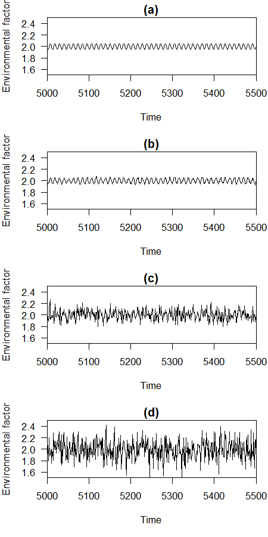
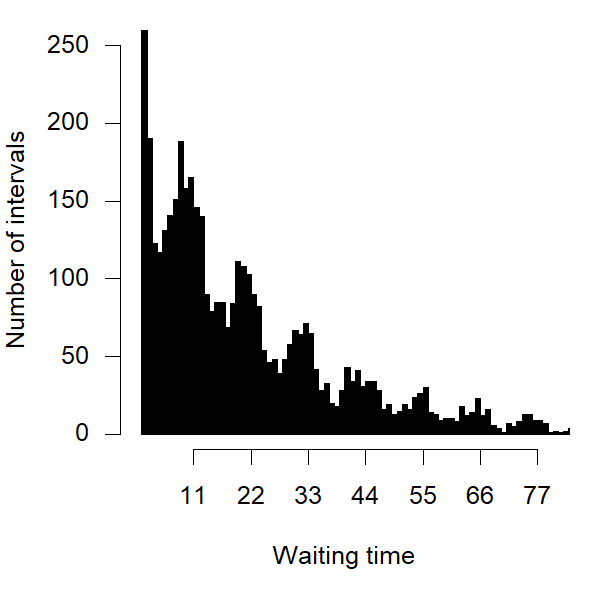

# Stochastic resonance exercise

Some coding exercise to replicate/understand Blarer, A., and M. Doebeli. 1999. Resonance effects and outbreaks in ecological time series. *Ecology Letters* 2:167--177.

## How to organisms detect environmental signal from noisy background?

## Figure 3 reproduced

## Figure 4a reproduced

